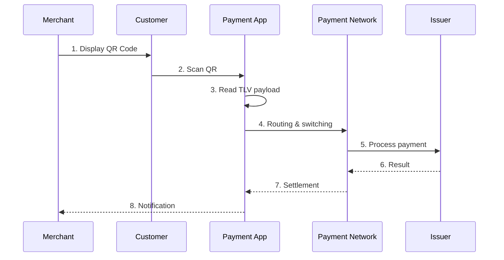
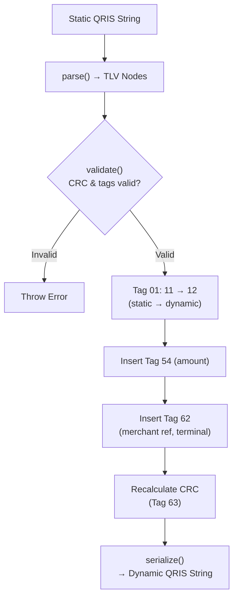
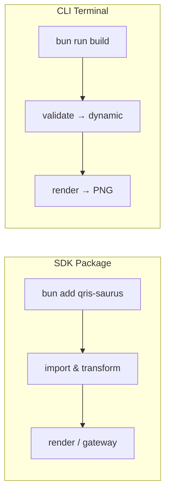

<div align="center">

# qris-saurus


A Bun/TypeScript SDK for parsing, validating, detecting providers, and transforming static QRIS into dynamic QRIS.

[](https://npmjs.com/package/qris-saurus)
[](LICENSE)
[](https://github.com/creasico/qris-saurus/actions)
[](https://bun.sh)

</div>

English | [Bahasa Indonesia](./README.md)

## Table of Contents

- [What is QRIS?](#what-is-qris)
- [How does QRIS work?](#how-does-qris-work)
- [Static vs dynamic QRIS](#static-vs-dynamic-qris)
- [How does qris-saurus work?](#how-does-qris-saurus-work)
- [Goals](#goals)
- [Install](#install)
- [Configure Environment](#configure-environment)
- [Quick start](#quick-start)
- [Simple Implementation](#simple-implementation)
- [Full Examples](#full-examples)
- [Error handling](#error-handling)
- [Gateway & Custom Providers](#gateway--custom-providers)
- [Multi-method Gateway Payments](#multi-method-gateway-payments)
- [CLI](#cli)
- [Documentation](#documentation)

## What is QRIS?

QRIS is Indonesia's QR payment standard that unifies many payment methods under a single QR format. Technically, a QRIS payload is a **TLV** (`Tag-Length-Value`) string based on the EMVCo specification. Each segment contains:

- `Tag`: the field identifier, for example `54` for amount
- `Length`: the length of the field value
- `Value`: the field content

A simple example:

```text
540812500.00
```

Meaning:
- `54` = transaction amount
- `08` = value length
- `12500.00` = amount value

## How does QRIS work?

In general, the flow looks like this:

1. **The merchant has a QRIS payload**
   - it can be a static QRIS from an acquirer or gateway
   - it can be a dynamic QRIS already generated by a gateway
2. **The customer scans the QR** using an app such as ShopeePay, GoPay, mobile banking, or another QRIS-enabled app
3. **The app reads the TLV payload** and displays merchant/transaction information
4. **Switching and routing** are handled by the payment ecosystem based on merchant and acquirer identifiers
5. **The issuer processes the payment**
6. **The merchant receives notifications or settlement** from the gateway or acquirer

This library operates at the **payload construction/manipulation** layer, not the settlement or switching network layer.



## Static vs dynamic QRIS

### Static QRIS
Usually used for permanent merchant displays. The amount is not embedded in the payload, so the customer enters the amount manually or the amount is determined by the payment app flow.

Common characteristics:
- point of initiation method `11`
- reusable multiple times
- not tied to a single transaction

### Dynamic QRIS
Created for a specific transaction. The amount and additional data can be embedded in the payload.

Common characteristics:
- point of initiation method `12`
- transaction amount is stored in tag `54`
- can carry extra references in tag `62`
- better suited for checkout, invoices, POS, and order-based payments

## How does qris-saurus work?

`qris-saurus` follows this flow:

1. **parse** the QRIS payload into a TLV structure
2. **validate** the basic structure and CRC
3. **detectProvider** if the provider identifier is recognized
4. **transform** static QRIS into dynamic QRIS
5. **serialize** the new payload and recalculate the CRC



The library supports two modes: **local transformation** from static QRIS into valid dynamic QRIS, and **gateway payments** for creating dynamic QRIS directly through providers such as Midtrans, Xendit, Duitku, and DOKU.

## Goals

- Transform static QRIS into dynamic QRIS locally
- Keep the payload valid with the correct CRC
- Provide a provider-aware foundation for ShopeePay, GoPay, Midtrans, Xendit, Duitku, and DOKU
- Be easy to import from other Bun/TypeScript projects

## Install

Install with your preferred package manager:

```bash
npm install qris-saurus
```

```bash
pnpm add qris-saurus
```

```bash
bun add qris-saurus
```

If you are working on this repository locally:

```bash
bun install
```

## Configure Environment

Create a `.env` file from the template:

```bash
cp .env.example .env
```

## Quick start

```ts
import { makeDynamic, staticToDynamic, validate } from "qris-saurus";

const dynamicQris = staticToDynamic(staticQrisString, {
  amount: 12500,
  merchantRef: "INV-001",
  terminalLabel: "POS-A",
});

const result = makeDynamic(staticQrisString, {
  amount: 12500,
});

console.log(dynamicQris);
console.log(result.provider);
console.log(validate(dynamicQris));
```

## Simple Implementation

There are two ways to use qris-saurus: as a **package** (SDK) in your TypeScript/Bun project, or directly via the **CLI** in your terminal.



### Package (SDK)

```bash
bun add qris-saurus
```

```ts
import { makeDynamic, renderQrToDataUrl, validate } from "qris-saurus";

const STATIC_QRIS = "00020101021126610016ID.CO.SHOPEE.WWW...";

// 1. Transform static → dynamic
const { qrisString, provider } = makeDynamic(STATIC_QRIS, {
  amount: 25000,
  merchantRef: "INV-001",
});

// 2. Validate the result
validate(qrisString); // { valid: true, errors: [] }

// 3. Render to image
const qrImage = await renderQrToDataUrl(qrisString, { width: 320 });
// 
```

### CLI

```bash
# Build CLI
bun run build

# Validate payload
bun run dist/cli.js validate "000201010211..."

# Transform static → dynamic
bun run dist/cli.js dynamic "000201010211..." --amount 25000 --merchant-ref INV-001

# Render to PNG file
bun run dist/cli.js render "000201010211..." --output ./qris.png
```

## Full Examples

Standalone examples are available in the [`examples`](./examples) folder:

```bash
bun run examples/basic.ts    # Core API: parse, validate, detect, transform
bun run examples/render.ts   # Render QR to file and data URL
bun run examples/gateway.ts  # Gateway integration (Midtrans, Xendit, Duitku, DOKU)
```

### Parse a QRIS payload

```ts
import { parse } from "qris-saurus";

const qris =
  "00020101021126610016ID.CO.SHOPEE.WWW01189360091800230223530208230223530303UMI51440014ID.CO.QRIS.WWW0215ID10265163524850303UMI5204581753033605802ID5913Chick n booth6010PEKALONGAN61055118262070703A016304B9ED";

const parsed = parse(qris);

parsed.nodes.find((n) => n.id === "59")?.value; // "Chick n booth"
parsed.nodes.find((n) => n.id === "60")?.value; // "PEKALONGAN"
parsed.nodes.find((n) => n.id === "53")?.value; // "360" (IDR)
parsed.crc; // "B9ED"
```

### Validate a payload

```ts
import { validate } from "qris-saurus";

const result = validate(qris);
// { valid: true, errors: [] }

const tampered = qris.slice(0, -4) + "0000";
const invalid = validate(tampered);
// { valid: false, errors: ["Invalid CRC value"] }
```

### Detect provider

```ts
import { detectProvider, listProviders } from "qris-saurus";

const provider = detectProvider(qris);
console.log(provider?.info.code);    // "shopeepay"
console.log(provider?.info.name);    // "ShopeePay"
console.log(provider?.info.supportsApiDynamic); // false

const all = listProviders();
for (const p of all) {
  console.log(`${p.info.code}: ${p.info.name}`);
}
```

### Transform static to dynamic

```ts
import { staticToDynamic } from "qris-saurus";

const dynamic = staticToDynamic(qris, {
  amount: 75000,
  merchantRef: "ORD-2024-001",
  terminalLabel: "POS-01",
});
```

### Transform with tips

```ts
import { staticToDynamic } from "qris-saurus";

// Fixed tip (Rp 2,000)
const withFixedTip = staticToDynamic(qris, {
  amount: 50000,
  tipType: "fixed",
  tipValue: 2000,
});

// Percent tip (5%)
const withPercentTip = staticToDynamic(qris, {
  amount: 50000,
  tipType: "percent",
  tipValue: 5,
});
```

### makeDynamic with provider detection

```ts
import { makeDynamic } from "qris-saurus";

const result = makeDynamic(qris, {
  amount: 25000,
  merchantRef: "INV-001",
});

console.log(result.source);   // "local" (local transformation)
console.log(result.provider); // "shopeepay"
console.log(result.amount);   // 25000
console.log(result.qrisString); // new dynamic payload
```

### CRC and serialization

```ts
import { computeCrc, verifyCrc, parse, serialize } from "qris-saurus";

// Compute CRC from payload (including trailing "6304")
const payload = qris.slice(0, -4); // strip 4-char CRC, keep "6304"
const crc = computeCrc(payload);
console.log(crc); // "1669"

// Verify CRC on a QRIS string
const isValid = verifyCrc(qris);
console.log(isValid); // true

// Parse then serialize — payload must be identical
const parsed = parse(qris);
const reserialized = serialize(parsed);
console.log(qris === reserialized); // true
```

### Render QR to image

```ts
import { renderQrToDataUrl, renderQrToFile, makeDynamic } from "qris-saurus";

const { qrisString } = makeDynamic(qris, { amount: 50000 });

// Base64 data URL — use directly in HTML
const dataUrl = await renderQrToDataUrl(qrisString, { width: 320 });
// data:image/png;base64,...

// Save to file
await renderQrToFile(qrisString, "./qris.png", { width: 400, margin: 3 });
```

### Error handling

```ts
import { validate, parse, makeDynamic, staticToDynamic } from "qris-saurus";

// validate() never throws — returns { valid, errors }
const check = validate("not-a-qris");
// { valid: false, errors: ["QRIS payload too short"] }

// parse() throws when CRC is missing/invalid
try {
  parse("invalid");
} catch (err) {
  console.error(err.message); // "QRIS payload is missing CRC tag"
}

// staticToDynamic() throws on already-dynamic QRIS
const dynamic = staticToDynamic(qris, { amount: 10000 });
try {
  staticToDynamic(dynamic, { amount: 10000 });
} catch (err) {
  console.error(err.message); // "QRIS payload is already dynamic"
}

// staticToDynamic() throws on negative amount
try {
  staticToDynamic(qris, { amount: -500 });
} catch (err) {
  console.error(err.message); // "Amount must be a positive number"
}
```

## Error handling

`validate()` is synchronous and never throws — it returns a `ValidationResult`. However, `parse()`, `staticToDynamic()`, and `makeDynamic()` may throw when the input is invalid. Gateway adapters use `async/await` and may throw if the request fails.

## Gateway & Custom Providers

The SDK provides a `gateway` singleton to simplify integrating various providers (Midtrans, Xendit, Duitku, DOKU) through a single centralized interface. The gateway delegates calls to the adapter without needing manual provider checks in your code:

```ts
import { gateway } from "qris-saurus";

// 1. Configure
gateway.configure({ 
  provider: "midtrans",
  serverKey: "SB-Mid-server-xxx", // or set MIDTRANS_SERVER_KEY env var
  sandbox: true 
}); 

// 2. Use abstract methods (charge, verify, status) without caring which provider is active
const chargeResult = await gateway.charge("INV-001", 50000);
const statusResult = await gateway.status("INV-001");
const verifyResult = gateway.verify(webhookPayload, headers); // verify is synchronous
// DOKU: pass rawBody when your framework exposes it.
const dokuVerifyResult = gateway.verify(webhookPayload, headers, { rawBody });
```

### Supporting Custom Providers (Scaling)

The gateway architecture is highly scalable. You can easily bring your own provider (e.g., another Biller or internal gateway) without modifying the core library. Just implement the `GatewayAdapter` interface which requires 4 core operations: `createDynamicQr`, `checkPaymentStatus`, `parseWebhook`, and `pollPaymentStatus`.

There are two approaches to mount a custom adapter:

**1. `gateway.useAdapter()` (Direct Injection)**

Use this method to inject the adapter instance directly into the singleton. Great if you initialize the instance in your own module:

```ts
import { gateway, type GatewayAdapter } from "qris-saurus";

class FinpayAdapter implements GatewayAdapter {
  // ...implement 4 core operations
}

// Inject adapter directly
gateway.useAdapter("finpay", new FinpayAdapter(), { apiKey: "secret" });

// Ready to use
await gateway.charge("INV-FIN", 10000); 
```

**2. `Gateway.registerProvider()` (Factory Registration)**

Use this method if you're building a library or helper that registers the provider globally, so that your application later only needs to call `gateway.configure()`:

```ts
import { Gateway, gateway } from "qris-saurus";

// Register to SDK's built-in factory
Gateway.registerProvider("finpay", () => new FinpayAdapter());

// Now it can be used like a built-in provider
gateway.configure({ 
  provider: "finpay",
  apiKey: "secret" 
} as any); // custom provider not yet in GatewayConfig type
```

## Multi-method Gateway Payments

Beyond the legacy QRIS gateway API (`charge()` / `createDynamicQr()`), `qris-saurus` now has a multi-method foundation:

- `gateway.capabilities()` reads provider-supported payment methods.
- `gateway.createPayment()` handles direct API/custom UI payments (`qris`, `virtual_account`, `ewallet`).
- `gateway.createCheckout()` handles provider-hosted checkout/payment pages.
- Webhooks remain the source of truth; redirects and polling are UX/fallback only.

```ts
gateway.configure({
  provider: "midtrans",
  serverKey: process.env.MIDTRANS_SERVER_KEY!,
  sandbox: true,
});

const va = await gateway.createPayment({
  method: "virtual_account",
  orderId: "INV-VA-001",
  amount: 50_000,
  bank: "bca",
  customerEmail: "customer@example.com",
});

const checkout = await gateway.createCheckout({
  orderId: "INV-CO-001",
  amount: 75_000,
  enabledMethods: ["qris", "virtual_account", "ewallet"],
  notificationUrl: "https://merchant.example/webhooks/midtrans",
});
```

See [docs/en/sdk/payments.md](./docs/en/sdk/payments.md) for direct payment vs hosted checkout details, provider capabilities, and webhook best practices.

## CLI

After building, the CLI is available as `qris-saurus`.

```bash
bun run build
bun run dist/cli.js --help
```

## Documentation

See the English docs in [`docs/en`](./docs/en):

- [`docs/en/sdk/index.md`](./docs/en/sdk/index.md) — SDK overview & quick start
- [`docs/en/sdk/api.md`](./docs/en/sdk/api.md) — full API reference
- [`docs/en/sdk/workflow.md`](./docs/en/sdk/workflow.md) — end-to-end workflow guide
- [`docs/en/sdk/gateway.md`](./docs/en/sdk/gateway.md) — gateway adapters & payment status checks
- [`docs/en/architecture.md`](./docs/en/architecture.md) — library internal design
- [`docs/en/qris-dynamic.md`](./docs/en/qris-dynamic.md) — dynamic QRIS and TLV details
- [`docs/en/providers.md`](./docs/en/providers.md) — provider-specific notes
- [`docs/en/cli.md`](./docs/en/cli.md) — complete CLI guide

For the Indonesian documentation, see [`README.md`](./README.md) and [`docs/`](./docs).
